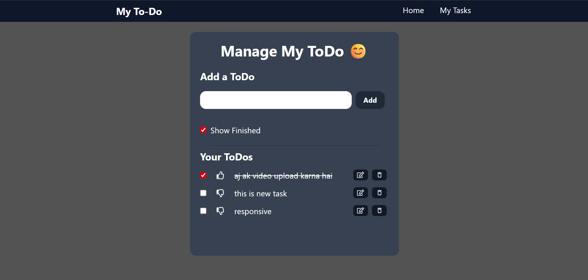

# 📝 To-Do App

A simple and responsive To-Do application built using **React.js**, **Tailwind CSS**, and **Vite**.  
This app helps users manage daily tasks efficiently with a clean and intuitive interface.

---

## 🚀 Live Demo

🔗 [Click here to view the live app](https://todo-app-c2hl.onrender.com)

---

## 📌 Features

- ➕ Add new tasks
- ✅ Mark tasks as completed
- ❌ Delete tasks
- 📱 Responsive design for mobile and desktop
- ⚡ Built with Vite for fast performance

---

## 📸 Screenshot

⚙️ Tech Stack
Frontend: React.js
Styling: Tailwind CSS
Bundler: Vite.js
Language: JavaScript (ES6+)

📦 Getting Started Locally
Follow these steps to run the project on your local machine:

# Clone the repository

git clone https://github.com/Sumit-Kushwah-786/todo-app.git

# Navigate to the project directory

cd todo-app

# Install dependencies

npm install

# Start the development server

npm run dev

Open your browser at http://localhost:5173 to view the app.

🙋‍♂️ Author
Sumit Kushwah
📧 sumitkushwah33221@gmail.com
🌐 GitHub | LinkedIn
